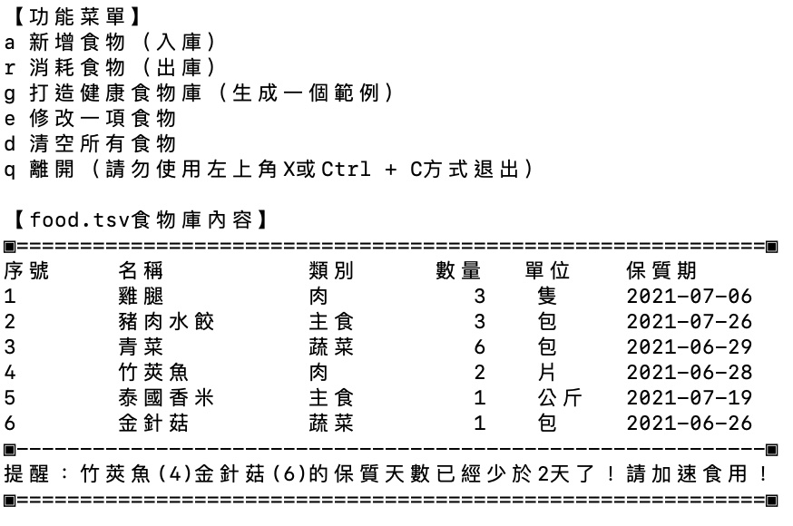

# FOODMANAGE個人食物庫存管理系統

疫情期間食物混亂，常常遇到食物慢慢在冰箱腐爛嗎？  
疫情期間買了太多零食，忘記自己到底有多少卡路里要消化嗎？  
打開Excel等太久，不耐煩做庫存整理嗎？  
還在用冰箱便利貼來完成庫存標示嗎？  

歡迎嘗試使用我花了一個半天寫的【個人食物庫存管理系統】。

【特點】

1. 啟動快速：僅需1秒
2. 指令簡單：不複雜，一點都不複雜！
3. 存儲格式友好：自動存儲為tsv格式，excel等無數軟體可以開啟
4. 自動備份：每次關閉時自動按日期時間備份一次
5. 自動提醒保質期：計算食物保質天數，每次開啟都會提醒
6. 體積超小：存儲檔不到1KB，程式本身不到30KB

【更新v0.5】

1. 自動按照類別對食物進行排序
2. 食物類別可進行新增修改

[下載地址](https://github.com/fireindark707/food_manage/raw/main/%E9%A3%9F%E7%89%A9%E5%BA%AB%E5%AD%98%E7%AE%A1%E7%90%86%E7%B3%BB%E7%B5%B1v0.5.zip)

說明：目前僅限macOS，下載解壓縮後直接雙擊運行food即可。如果有問題請跟我說。windows我還在等人協助提供編譯環境@@ 歡迎協助

---

